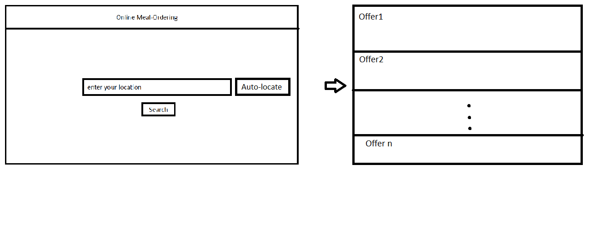
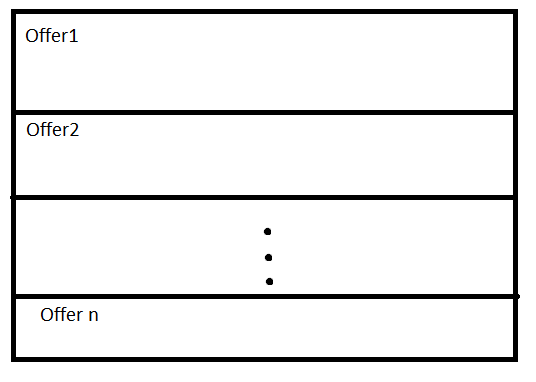
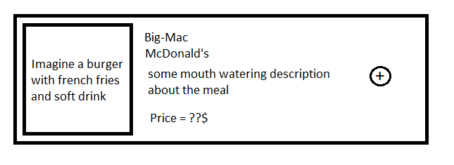
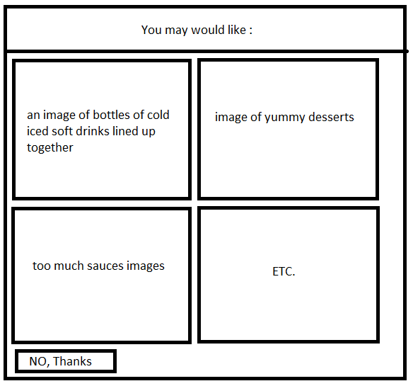
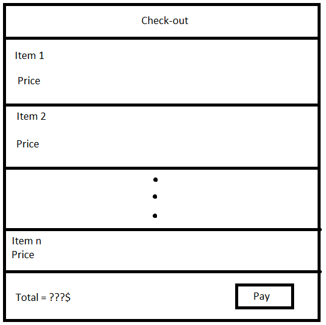

.. OMO documentation master file, created by
   sphinx-quickstart on Fri Sep 20 20:20:16 2019.
   You can adapt this file completely to your liking, but it should at least
   contain the root `toctree` directive.

==================================
Online Meal-Ordering Website (OMO) 
==================================

.. toctree::
   :maxdepth: 2
   :caption: Contents:

Introduction 
============
Purpose 
-------
This document was written to specify OMO’s website requirements specifications for the developers, designers, maintainers, and stakeholders.

Scope 
-----
OMO is an online meal ordering website, which basically from the community and to the community, from the community: as it provides the users with a verity of food options and deals associated with several restaurants; and to the community as it saves the user's effort of going around the street looking for good food deals and better experience.
This website is beneficial to the users, restaurants, addvertisers, and organizations.

Definitions and Abbreviations 
-----------------------------
References  
----------
- Food Delivery service in WeChat app.
- https://www.ubereats.com/

The Overall Description 
=======================

Product Perspective 
-------------------
This website is a self-contained product: which means that it is not a sub of a larger website.
Although, the idea not new, actually it is based on several examples (*as mentioned in the reference section*), but still this website is for a study purposes.

Product Features 
----------------
The website allows the users to select thier location to provide the nearby restaurants deals, as well as a verity of categories that the user can choose from.
also the user can select three ways to receive his orders, delivery, pick-up, or dine in.
each meal has rating, orders count, and general details.
the user can add meals to the cart, then select all the meals in the cart or some of them to proceed to the check-out where he can pay the total amount and receive the confirmation message as well as the order number.

User Characteristics 
--------------------
+-------+---------------------------------------------------------------+----------------+
|Type   | Description                                                   | Privilege      |
+=======+===============================================================+================+
|Admin  | website maintainer, to manipulate the meals, ads, and so on   | Full-Access    |
+-------+---------------------------------------------------------------+----------------+
|User   | Can surface, log-in, create acount, and buy food              | Limited-Access |
+-------+---------------------------------------------------------------+----------------+

Operating Environment 
---------------------
OMO must be accessible by the common browsers such as, Chrome, FireFox, IE, and Opera. for both Computers and Smart-Phones.

Constraints 
-----------
* OMO must be secure and stable, there must be a at least two hosts such that in case of an outage of the first host the second host continue hosting the website so there is no any inconvenience to the customers. 
* The interface must be focused on the food and only the food so the costumer don't get disturbed.
* Ads must be relevent to the website content.
* User's information must be protected and accessible only by the user himself and whom ever the user allow to access his/her data.
* The traffic on the website must be well handled in a way that keeps hte website robust and stable.

Assumptions 
-----------
* Some restaurants may prefer special ways to advertise thier products.
* Maintainers might prefer to change the interface in order to improve the quality.
* Users might type fake locations.
* In some delivery cases there might be an ancident in the delivery process.
* User may change his location after the order took place.

Specific Requirements 
=====================

Functional Requirements 
-----------------------
* **REQ1.0**: Admin account to add, delete, and update meals. 
* **REQ2.0**: Location, the user can type his/her own location, or allow the system to locate his/her location.

* **REQ3.0**: User can choose between, delivery, dine in, or pick-up. 
* **REQ4.0**: User can create acount, with his/her name, address, phone NO, email, and password. 

 * **REQ4.1** : If the user already got an account, then he/she can log-in. 

* **REQ5.0**: Show restaurants around the users diameter (approx 1-2KM). 
* **REQ6.0**: For each restaurant the user can see multiple meal offers. 

* **REQ7.0**: For each meal user can see, name, price, rating, and number of orders. 

* **REQ8.0**: User can select the meal either by the (+) plus button in the outter container of the meal(*see Fig1.3*), or by add to the cart button from inside the meal's page. 
* **REQ9.0**: User can filter the meals by category, for example, rice, pasta, sandwich, and so on. 
* **REQ10.0**: From the meal page selected meal page, the user can add sub-orders, for example soft drinks, sauce, chips, and so. 

* **REQ11.0**: Cart, user can select the desired meals and get the total amount updated for each selected item in the cart, then proceed to the check-out. 
* **REQ12.0**: In the check-out page, the user can use some coupons if available to get discounts, then he can pay by some of the payment methods, like WeChat, AliPay, Visa, and so on. 

* **REQ12.0**: After the check-out, the user redirected to the order information page, which contains the order number and the total amount payed by the user. 

Use Cases 
=========

Case 1 
------
* **Name** : Set Location.
* **Actor** : User, OMO
* **Entry Condition** : 

 * *User*: visits the website for the first time.
 * *User*: has valid GPS.
 * *User*: has network connection.

* **Exit Condition** : 

 * *User*: located his location.
 * *User*: created new account.

* **Flow of Events** :
 
 * *User*: enters OMO.
 * *OMO*: opens the Location page where the user can find his location.
 * *User*: types or allow the system to locate him.
 * *OMO*: forwards the user to account creation page.
 * *User*: Creates an account.

* **Special Requirements** :

NONE

Case 2 
------

* **Name** : Order a meal.
* **Actor** : User, OMO.
* **Entry Condition** : 

 * *User*: must be logged in.
 * *User*: has enough money.
 * *User*: has network connection.

* **Exit Condition** : 

 * *User*: user received the order information.

* **Flow of Events** :
 
 * *User*: select the desired meal.
 * *OMO*: adds the meal to the cart.
 * *User*: can select more or proceed to the cart.
 * *User*: can add more sub-orders for each order.
 * *OMO*: attaches the sub-order to the meal selected.
 * *User*: in the cart the user is double checking his order, can delete some items or go back to add more.
 * *User*: clicks on Check-Out button.
 * *OMO*: forwards the user to the check-out page where he can use coupons if any, or pay his bill.
 * *User*: pays by one of the payment methods.
 * *OMO*: forwards the user to the order information page where he can see his order number, total payment, and time left to receive his order.

* **Special Requirements** :

* *User*: must has valid way to pay his bill.

Case 3 
------

* **Name** : Admin Manipulation.
* **Actor** : Admin

* **Entry Condition** : 

 * *Admin*: must be logged in as admin.

* **Exit Condition** : 

 * *Admin*: Added, deleted, or updated some meals.

* **Flow of Events** :
 
 * *Admin*: logs in, goes to the panel.
 * *Admin*: selects some meals to be deleted via the panel page.
 * *Admin*: clicks submit, the meals has been deleted.
 * *Admin*: clicks add meal, top-up window shows up to fill the meal info, name, price, and so.
 * *Admin*: clicks submit, the meal is added to the website.
 * *Admin*: selects a meal, then click on update to change some of its attributes.
 * *Admin*: log-out.

* **Special Requirements** :

NONE

Non-Functional Requirements 
===========================

Performance Requirements 
------------------------

Since this web application is used frequently, the server may have to stand a heavy load of requests. Thus may cause some problems such as the system will go down for several times or lose response to its clients. On the other hand, if users have a big amount of orders, the time complexity must be taken into consideration. For the optimization aspects, the response time of the application depends on the amount of orders at a given time, for most cases if the orders are between 500-1K in the same time the response time must be between 5-10 seconds, and les than that if the orders at the same time are < 500.

Safety Requirements  
-------------------

The website must safe, such that, it doesn't do harm to it's clients by allowing some viruses or malwares to reach the clients side. Also must be protected against any attacks that maight happen on the website.

Security Requirements 
---------------------

Only maintainers are allowed to access the back side of the website.
Users are allowed on the front side only.
Admin only can manipulate and populate the website.
Strict authentications techniques must be taken in the account creation and log-in processes.

Confidentiality Policy 
======================

As a public website, the security of data must be a significant part to be considered especially for users, when users are using the website, their data must be used and stored properly. In other words, the website must maintain the users data's reliability, integration and secrecy and the user data will not be published without the agreement of the owner.

Future Changes 
==============

TBA

Indices and tables
==================

* :ref:`genindex`
* :ref:`modindex`
* :ref:`search`
